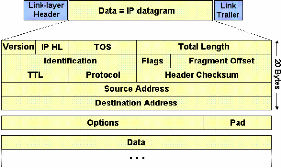
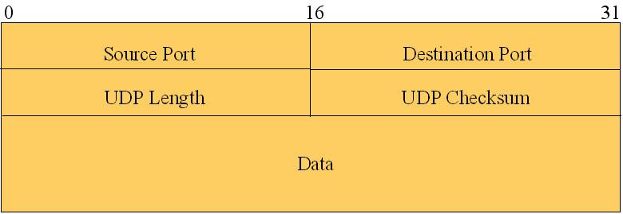

# NetworkSniffer
A sniffer for TCP and UDP packages

## IP V4  Protocol Header ##

## TCP Protocol Header ## 

## UDP Protocol Header ##

## Information Given ##

* [x] IP Version;
* [x] An overall of packages sniffed;
* [x] Total TCP packages sniffed;
* [x] Lost packages;
* [x] Information about each package header.

## Configuration ##

You will need to execute the application as a administrator, if you are going to run on VS or VS Code, run the VS as an administrator.
